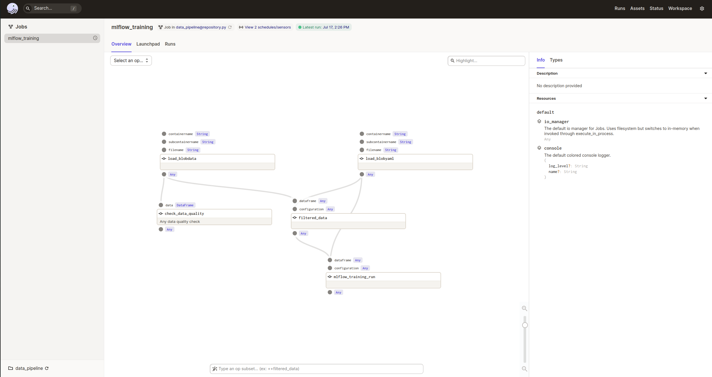
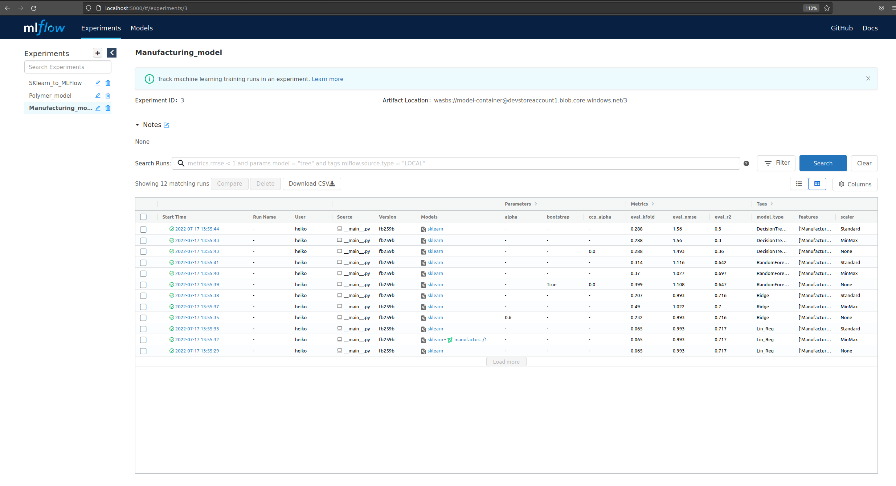

# Dagster and MLFlow

This Repo is about to use MLFlow within a Dagster Pipeline


This Repo is based on Poetry and can be executed within an virtual environment.

## Install

This Repo is based on poetry

```bash

python3 -m venv .venv

# or
python -m venv .venv

# switch manually to virtual environment and then

$(.venv) pip install poetry

$(.venv) poetry install 
# will install all dependencies from the pyproject.toml file

```

## Create an .env file


I use for local development Azurite and included the connectionsting of azurite to the .env file.

Moreover, the Blobcontainter name for the MLFlow Models: "model-container" and the basics for MLFlow Tracking are added.

```bash

LOCAL_RUN=True

# Working with Azurite
AZURE_STORAGE_CONNECTION_STRING="DefaultEndpointsProtocol=http;AccountName=devstoreaccount1;AccountKey=Eby8vdM02xNOcqFlqUwJPLlmEtlCDXJ1OUzFT50uSRZ6IFsuFq2UVErCz4I6tq/K1SZFPTOtr/KBHBeksoGMGw==;BlobEndpoint=http://localhost:10000/devstoreaccount1;QueueEndpoint=http://localhost:10001/devstoreaccount1"

AZURE_STORAGE_ACCOUNT="devstoreaccount1"

AZURE_ACCOUNT_KEY="Eby8vdM02xNOcqFlqUwJPLlmEtlCDXJ1OUzFT50uSRZ6IFsuFq2UVErCz4I6tq/K1SZFPTOtr/KBHBeksoGMGw=="


BLOB_MODEL_CONTAINER_NAME="model-container"


MLFLOW_TRACKING_URI="http://localhost:5000"
MLFLOW_MODEL_DIRECTORY = "models:"
MLFLOW_MODEL_STAGE = "Staging"


```


## Repo Structure

This Repo contains of several major folders.

```bash 

|
|- config_for_azure_blobstorage 
|- experimental
|- pipelines
    |- general
    |- job_standard_training 

```

The .yaml File in "config_for_azure_blobstorage" should be added the azurite container of this project.


## Azurite

Azurite mimics Azure Blobstorage, so we can create folders for our projects.

```bash

|
|- model-container   (for mlflow)
|- sklearn
    |- data
    |- configuration-data

```


Todos:

- Please put some data (`ChemicalManufacturingData.parquet`) in the "sklearn/data" folder.

- Please put the `job_mlflow_training_config.yaml` file from "config_for_azure_blobstorage" into the "configuration-data" folder.


## Structure of Dagster

Within the pipelines folder: 

- ops.py
- graph.py
- job.py
- trigger.py
- config_loads.yaml


### Ops.py

In the Ops.py file some basic functions are created, like loading data and the yaml file. 
Here also filtering, or quality checks can be added.

Here is a small list of functions that we can find within the ops.py:

- check_data_quality
- load_blobdata
- load_blobyaml
- filtered_data
- mlflow_training_run


### Graph.py

Within the graph we arrange the ops  

```bash

@graph
def mlflow_execution_graph():

    df = load_blobdata()

    run_config = load_blobyaml()

    check_data_quality(df)

    filtered_df=filtered_data(dataframe=df, configuration=run_config)

    mlflow_training_run(dataframe=filtered_df, configuration=run_config)


```

### Trigger.py

In the trigger.py file a sensor and a scheduler are added. 
The trigger reads the `local` config file (`config_loads.yaml`) where we define: 

```bash

blobcontainer: "sklearn"

subblobcontainer_data: "data"
filename_data: "ChemicalManufacturingProcess.parquet"

subblobcontainer_config: "configuration_data"
filename_config: "job_mlflow_training_config.yaml"

```
This can be easily modified later on and can is specific for each project. 


The `job_mlflow_training_config.yaml` file is for the training configuration of mlflow.


### Repository.py and Job.py

The `job.py` and `repository.py` files are very simple and only load the functions and execute them.

Check yourself and if needed modify them yourself.


## Execute the pipeline locally with dagit


We can run dagit locally on our maschines. 

Please run each of these commands in one bash command window:

```bash

# open 2 bash command windows and execute in each only one line

DAGSTER_HOME=$(pwd)/.dagster dagster-daemon run

DAGSTER_HOME=$(pwd)/.dagster dagit -f ./pipelines/repository.py

``` 





## MLFlow

We can find the mlflow results of the training runs in [http://localhost:5000/](http://localhost:5000/)




Please create an experiment like `Manufacturing_model` in MLFlow.

Select one trained model and register it, like in the other tutorials to use it further.


